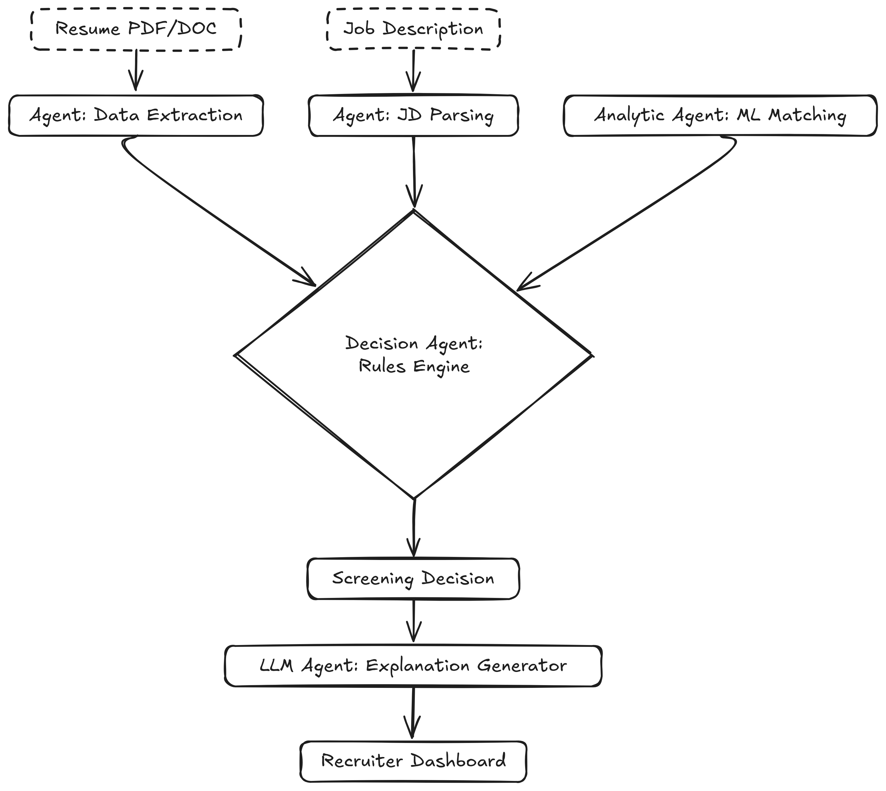

# Hierarchical AI Agents System

A sophisticated multi-tier agent system using LangGraph for coordinating research, writing, and visualization tasks.

<p align="center">
  
</p>

## 🏗️ Architecture

The system implements a three-tier hierarchy:

```
Super Supervisor
├── Research Team
│   ├── Search Agent (Tavily)
│   └── Web Scraper Agent
└── Writing Team
    ├── Document Writer
    ├── Note Taker
    └── Chart Generator
```

## ✨ Features

- **Hierarchical Coordination**: Multi-level supervisors coordinate specialized teams
- **Automated Task Routing**: Tasks are automatically routed to appropriate agents
- **Modular Design**: Each team can be used independently or as part of the hierarchy
- **Rich Tool Integration**: Web search, scraping, document management, and Python execution
- **Flexible LLM Support**: Works with OpenAI GPT-4 or Groq models

## 🚀 Quick Start

### 1. Environment Setup

Create a `.env` file with your API keys:

```bash
OPENAI_API_KEY=your_openai_key_here  # Optional
GROQ_API_KEY=your_groq_key_here      # Required
TAVILY_API_KEY=your_tavily_key_here  # Required
```

### 2. Installation

```bash
# Install dependencies
pip install -r requirements.txt

# Or using uv
uv pip install -r requirements.txt
```

### 3. Basic Usage

#### Using the Notebook
Open `agents.ipynb` for an interactive demonstration of the system.

#### Using the Python API

```python
from src.hierarchical_agents import HierarchicalSystem

# Initialize the system
system = HierarchicalSystem()

# Run a complex task
for step in system.run("Research machine learning and write a report"):
    print(step)
```

#### Using the CLI

```bash
# Run the main example
python main.py

# Run simple example
python example.py
```

## 📚 Usage Examples

### Research and Writing
```python
system = HierarchicalSystem()

# Complex task requiring both research and writing
result = system.run_sync(
    "Research the latest developments in AI safety and create a comprehensive report"
)
```

### Individual Team Usage
```python
# Use only the research team
research_result = system.research_team.invoke([
    ("user", "Find information about quantum computing")
])

# Use only the writing team
writing_result = system.writing_team.invoke([
    ("user", "Create an outline for a technical paper")
])
```

## 🛠️ Development

### Project Structure

```
├── src/hierarchical_agents/      # Main package
│   ├── __init__.py
│   ├── config.py                 # Configuration management
│   ├── supervisor.py            # Supervisor framework
│   ├── tools.py                 # Tool definitions
│   ├── research_team.py         # Research team implementation
│   ├── writing_team.py          # Writing team implementation
│   └── hierarchical_system.py   # Complete system
├── agents.ipynb                 # Interactive notebook
├── main.py                      # Main CLI example
├── example.py                   # Simple example
└── requirements.txt             # Dependencies
```

### Key Components

1. **Config**: Manages API keys and environment settings
2. **SupervisorFramework**: Creates LLM-powered supervisors for team coordination
3. **ToolsManager**: Provides specialized tools for different tasks
4. **ResearchTeam**: Coordinates web search and scraping
5. **WritingTeam**: Manages document creation and editing
6. **HierarchicalSystem**: Orchestrates the complete multi-team system

## 🔧 Configuration

### API Keys Required

- **Groq API Key**: For fast LLM inference (primary)
- **Tavily API Key**: For web search capabilities
- **OpenAI API Key**: Optional, alternative to Groq

### Environment Variables

```bash
USER_AGENT=HierarchicalAgents/1.0  # Set automatically
```

## 🧪 Testing

Run individual components:

```python
# Test research capabilities
system.research_team.invoke([("user", "Search for AI news")])

# Test writing capabilities  
system.writing_team.invoke([("user", "Create a document outline")])

# Test complete system
system.run("Research and write about renewable energy")
```

## 🤝 Contributing

1. Fork the repository
2. Create a feature branch
3. Make your changes
4. Add tests if applicable
5. Submit a pull request

## 📄 License

This project is open source. Please check the license file for details.

## 🐛 Troubleshooting

### Common Issues

1. **Import Errors**: Make sure to install requirements and add `src/` to Python path
2. **API Key Errors**: Verify your `.env` file contains valid API keys
3. **Network Issues**: Check internet connection for web search functionality

### Getting Help

- Check the notebook `agents.ipynb` for detailed examples
- Review the modular code in `src/hierarchical_agents/`
- Run `python example.py` for a simple test

## 🚀 Future Enhancements

- [ ] Web interface for easier interaction
- [ ] Memory persistence across sessions
- [ ] Additional specialized teams (data analysis, code generation)
- [ ] Enhanced error handling and retry mechanisms
- [ ] Performance monitoring and logging
